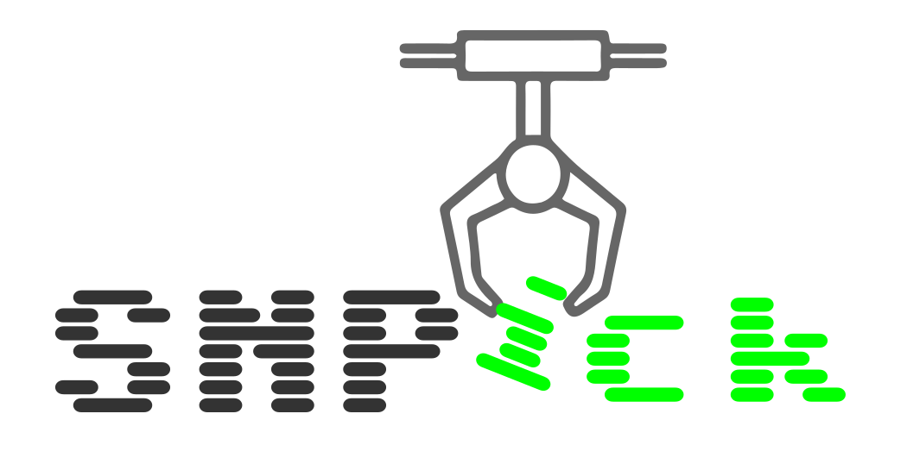

<p align="center">
  
</p>

<div align="center">
  
[](https://github.com/PathoGenOmics-Lab/snpick/blob/main/LICENSE) 
[](https://github.com/PathoGenOmics-Lab)
[](https://anaconda.org/bioconda/snpick)
[](https://anaconda.org/bioconda/snpick)
[](https://doi.org/10.5281/zenodo.14191809)
[](http://bioconda.github.io/recipes/snpick/README.html)

</div>

__Paula Ruiz-Rodriguez<sup>1</sup>__ 
__and Mireia Coscolla<sup>1</sup>__
<br>
<sub> 1. Institute for Integrative Systems Biology, I<sup>2</sup>SysBio, University of Valencia-CSIC, Valencia, Spain </sub>  

# SNPick

SNPick is a fast and memory-efficient tool designed to extract SNP (Single Nucleotide Polymorphism) sites from large-scale FASTA alignments, taking into consideration IUPAC ambiguous nucleotides. SNP analysis is critical for understanding genetic variation, phylogenetic relationships, and evolutionary biology.

## Problematic

Tools like **snp-sites** have been widely used to extract SNP positions from FASTA alignments. **snp-sites** is a valuable tool for smaller datasets, providing an effective solution for extracting SNPs in many research scenarios. However, it faces significant challenges when processing large alignments or a high number of sequences. **snp-sites** is not suitable for generating SNP datasets specifically designed for phylogenetic analyses of SNPs using ASC (Ascertainment Bias Correction) in tools like **RAxML** or **IQ-TREE**.

When dealing with thousands of sequences or large sequence lengths, **snp-sites** tends to become inefficient both in terms of runtime and memory usage. For instance, the tool may struggle or even fail entirely when processing datasets with hundreds of thousands of sequences or sequences that are several megabases in length. This limitation is particularly relevant for researchers who need to work with whole-genome alignments from many individuals, especially in epidemiological studies or population genomics.

## 🪝SNPick Advantage

**SNPick** was developed to overcome these limitations, providing a highly scalable and optimized approach to SNP extraction. Unlike **snp-sites**, SNPick employs parallel processing and an efficient memory management strategy, making it suitable for very large datasets. This scalability allows users to work with massive alignments, extracting SNPs in a fraction of the time and with significantly lower memory requirements compared to traditional tools.

The key benefits of SNPick include:
- **Scalability**: Able to handle datasets with tens of thousands of sequences and large genome alignments without a significant increase in memory consumption or processing time.
- **Efficiency**: Optimized for speed, taking advantage of multi-threading and efficient memory allocation.
- **Versatility**: Supports the extraction of SNPs while handling IUPAC ambiguous nucleotides, making it highly adaptable to different types of genomic data.

## 💾 Functionalities

SNPick provides input that is compatible with phylogenetic software like **RAxML** and **IQ-TREE** when performing ascertainment bias correction (asc bias). This ensures that the output is suitable for accurate downstream phylogenetic inference and evolutionary analyses.

SNPick offers multiple functionalities to facilitate comprehensive SNP analysis and ensure compatibility with downstream applications:

### 1. **FASTA SNP Extraction**

SNPick allows users to extract SNP sites from a given FASTA alignment file, providing an output file that contains only the SNP positions. This feature makes downstream analysis more efficient by significantly reducing the size of the dataset while retaining only informative sites.

### 2. **Multi-threading Support**

The tool supports multi-threading to expedite processing. Users can specify the number of threads using the `--threads` option, allowing SNPick to efficiently utilize available computational resources.

### 3. **Handling IUPAC Ambiguous Nucleotides**

SNPick considers IUPAC ambiguous nucleotides during the SNP extraction process. It can accurately identify variable positions even in the presence of ambiguous bases, ensuring that these nucleotides are appropriately handled.

### 4. **VCF Output Generation**

SNPick can generate Variant Call Format (VCF) files from the extracted SNP positions. This feature is particularly useful for users who need to integrate SNP data into other bioinformatics pipelines, as VCF is a standard format widely used in genetic variation studies.

- To generate a VCF file, use the `--vcf` flag and specify an output VCF file with `--vcf-output`. The resulting VCF file will contain detailed information about each SNP position, including reference and alternate bases, and the base observed in each sample.

Example command to generate a VCF file:

```sh
snpick --fasta input_alignment.fasta --output snp_alignment.fasta --vcf --vcf-output snp_output.vcf --threads 8
```

### 5. **Efficient Memory Usage**

SNPick is designed to handle large-scale datasets without consuming excessive memory. By using efficient memory management and parallel processing, SNPick ensures that even extremely large alignments can be processed on standard computational infrastructure.
### 6. **Progress Monitoring**

The tool includes progress monitoring to keep users informed about the current status of the analysis. This is particularly useful for long-running processes on large datasets. SNPick provides a spinner and a progress bar to indicate the status of sequence reading, SNP identification, and writing processes.
Usage

SNPick can be easily integrated into existing pipelines for genomic data analysis. It is suitable for use in environments where memory efficiency and processing speed are crucial, such as analyzing large microbial datasets or conducting comparative genomic studies.

## 🛠️ Installation
You can install snpick via conda, mamba (for unix/mac) or downloading [the binary file](https://github.com/PathoGenOmics-Lab/snpick/releases/download/1.0.0/snpick) (unix):

### 🐍 Using conda
```
conda install -c bioconda snpick
```
### 🐍 Using mamba
```
mamba install -c bioconda snpick
```
### 📨 Using binary
```
wget https://github.com/PathoGenOmics-Lab/snpick/releases/download/1.0.0/snpick
```

## 🗃️ Arguments

SNPick provides a variety of arguments to customize the SNP extraction process:

- `--fasta` (**required**): Specifies the input alignment file in FASTA format. This file contains the aligned sequences from which SNPs will be extracted.
- `--output` (**required**): Specifies the output file that will contain only the SNP sites extracted from the input alignment.
- `--threads` (**optional**): Specifies the number of threads to use for multi-threading. By default, SNPick uses 4 threads, but this can be adjusted to take advantage of additional computational resources for faster processing.
- `--vcf` (**optional**): If provided, generates a Variant Call Format (VCF) file with the SNP information. VCF is a standard format widely used for genetic variation studies.
- `--vcf-output` (**optional**): Specifies the output VCF file name. This argument is used in combination with `--vcf` to store detailed information about each SNP position, including reference and alternate bases, and the observed base for each sample.
- `--include-gaps` (**optional**): When this flag is used, SNPick will consider gaps (`-`) in the sequences as valid characters when determining variable positions. This can be useful for certain types of evolutionary analyses where gaps are informative.

## 🎴 Example

To extract SNPs from a given FASTA file:
```sh
snpick --fasta input_alignment.fasta --output snp_alignment.fasta --threads 8
```
**Input**: The `--fasta` parameter specifies the input alignment file in FASTA format. This file contains the aligned sequences from which SNPs will be extracted.

**Output**: The `--output` parameter specifies the output file, which will contain only the SNP sites extracted from the input alignment.

This command will generate an output file containing only the SNP sites, optimized for downstream analysis.
### Input and Output Example

Input File (input_alignment.fasta):
```sh
>sequence1
ATGCTAGCTAGCTAGCTA
>sequence2
ATGCTAGCTGGCTAGCTA
>sequence3
ATGCTAGCTAGCTAGCTA
```
Output File (snp_alignment.fasta):
```sh
>sequence1
T
>sequence2
G
>sequence3
T
```
In this example, the SNP site is at the position where sequence2 has a G while the others have a T.
### Another Example

If you have a large dataset and want to utilize all available CPU cores for faster processing, you can use the following command:
```sh
snpick --fasta large_dataset.fasta --output snp_large_output.fasta --threads 16
```
In this example, large_dataset.fasta is the input file, snp_large_output.fasta is the output file, and --threads 16 specifies the use of 16 CPU threads to speed up the SNP extraction process.

---
<h2 id="contributors" align="center">

✨ [Contributors]((https://github.com/PathoGenOmics-Lab/AMAP/graphs/contributors))
</h2>

<!-- ALL-CONTRIBUTORS-LIST:START - Do not remove or modify this section -->
<!-- prettier-ignore-start -->
<!-- markdownlint-disable -->
<div align="center">
SNPick is developed with ❤️ by:
<table>
  <tr>
    <td align="center">
      <a href="https://github.com/paururo">
        
        <br />
        <sub><b>Paula Ruiz-Rodriguez</b></sub>
      </a>
      <br />
      <a href="" title="Code">💻</a>
      <a href="" title="Research">🔬</a>
      <a href="" title="Ideas">🤔</a>
      <a href="" title="Data">🔣</a>
      <a href="" title="Desing">🎨</a>
      <a href="" title="Tool">🔧</a>
    </td> 
    <td align="center">
      <a href="https://github.com/mireiacoscolla">
        
        <br />
        <sub><b>Mireia Coscolla</b></sub>
      </a>
      <br />
      <a href="https://www.uv.es/instituto-biologia-integrativa-sistemas-i2sysbio/es/investigacion/proyectos/proyectos-actuales/mol-tb-host-1286169137294/ProjecteInves.html?id=1286289780236" title="Funding/Grant Finders">🔍</a>
      <a href="" title="Ideas">🤔</a>
      <a href="" title="Mentoring">🧑‍🏫</a>
      <a href="" title="Research">🔬</a>
      <a href="" title="User Testing">📓</a>
    </td> 
  </tr>
</table>

This project follows the [all-contributors](https://github.com/all-contributors/all-contributors) specification ([emoji key](https://allcontributors.org/docs/en/emoji-key)).

<!-- markdownlint-restore -->
<!-- prettier-ignore-end -->

<!-- ALL-CONTRIBUTORS-LIST:END -->
--- 
