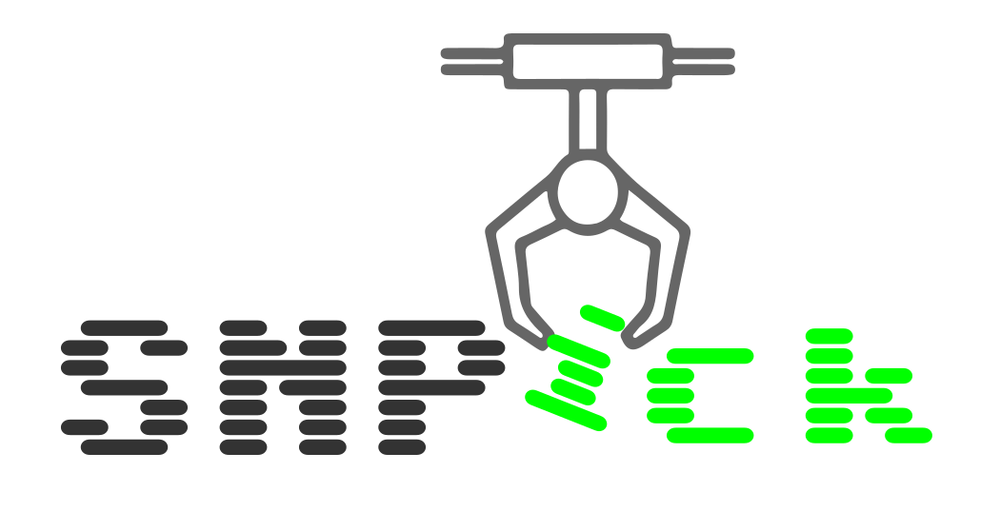
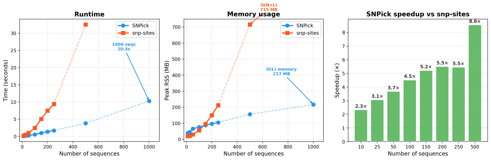
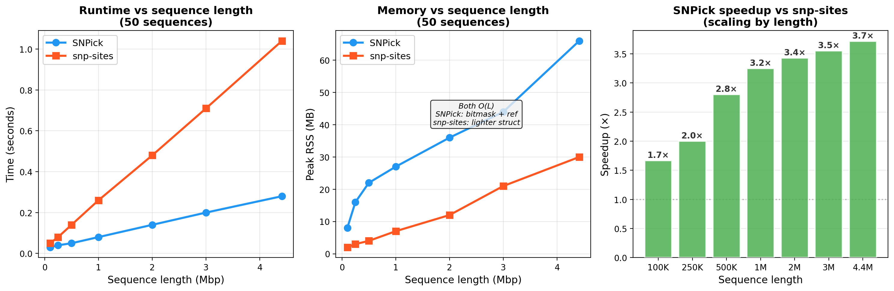

<p align="center">
  
</p>

<div align="center">

[](LICENSE)
[](https://doi.org/10.5281/zenodo.14191809)
[](https://github.com/PathoGenOmics-Lab)
[](https://anaconda.org/bioconda/snpick)
[](http://bioconda.github.io/recipes/snpick/README.html)

**Fast, memory-efficient extraction of variable sites from FASTA alignments.**

[Quick Start](#-quick-start) · [Features](#-features) · [Usage](#-usage) · [Benchmarks](#-benchmarks) · [Citation](#-citation)

</div>

__Paula Ruiz-Rodriguez<sup>1</sup>__
__and Mireia Coscolla<sup>1</sup>__
<br>
<sub> 1. Institute for Integrative Systems Biology, I<sup>2</sup>SysBio, University of Valencia-CSIC, Valencia, Spain </sub>

---

## What is SNPick?

SNPick extracts variable (SNP) sites from whole-genome FASTA alignments. It produces reduced alignments ready for phylogenetic inference with ascertainment bias correction (ASC) in **IQ-TREE** and **RAxML**, and optionally generates VCF files.

**Why not snp-sites?** snp-sites works well for small datasets but struggles with large alignments — it loads everything into memory and scales poorly. SNPick uses a zero-copy memory-mapped architecture that handles thousands of genomes in seconds with minimal RAM.

### SNPick vs snp-sites

| | **SNPick** | **snp-sites** |
|---|---|---|
| Architecture | Zero-copy mmap, parallel scan | Full matrix in memory |
| 250 seqs × 4.4 Mbp | **0.9 s**, 105 MB | 9.5 s, 520 MB |
| 1000 seqs × 4.4 Mbp | **~3 s**, ~140 MB | >26 min (killed), 3+ GB |
| ASC fconst output | ✅ Built-in | ❌ Not supported |
| VCF output | ✅ Optional | ✅ Default |
| Gap handling | ✅ Optional (`-g`) | ✅ Default |
| IUPAC ambiguous | ✅ Tracked as ambiguous | ⚠️ Treated as variant |

---

## 🚀 Quick Start

```bash
# Install
conda install -c bioconda snpick

# Extract variable sites
snpick -f alignment.fasta -o snps.fasta

# With VCF output
snpick -f alignment.fasta -o snps.fasta --vcf

# Include gaps as informative
snpick -f alignment.fasta -o snps.fasta -g
```

---

## ✨ Features

### Variable site extraction

Identifies positions with more than one observed nucleotide across all sequences. Constant and ambiguous-only positions are excluded from the output.

### ASC bias correction support

Reports constant site counts (`fconst`) directly, formatted for IQ-TREE's `+ASC` models:

```
[snpick] ASC fconst: 744123,1382922,1382180,743556
```

Use in IQ-TREE:
```bash
iqtree2 -s snps.fasta -m GTR+ASC -fconst 744123,1382922,1382180,743556
```

### VCF generation

Optional VCF v4.2 output with per-sample genotypes. Reference allele taken from the first sequence. Ambiguous bases reported as missing (`.`).

### IUPAC and gap handling

- **Ambiguous bases** (N, R, Y, etc.): not counted as alleles — positions are only variable if they have ≥2 standard bases (A, C, G, T)
- **Gaps** (`-`): ignored by default, included as a 5th character with `-g`

### Parallel processing

Automatic multi-threaded scanning via Rayon when the dataset is large enough. Falls back to single-threaded for small inputs to avoid overhead.

---

## 💾 Installation

### Bioconda (recommended)

```bash
conda install -c bioconda snpick
# or
mamba install -c bioconda snpick
```

### From source

```bash
git clone https://github.com/PathoGenOmics-Lab/snpick.git
cd snpick
cargo build --release
# Binary at target/release/snpick
```

### Pre-built binary (Linux)

```bash
wget https://github.com/PathoGenOmics-Lab/snpick/releases/latest/download/snpick
chmod +x snpick
```

---

## 🗃️ Usage

```
snpick [OPTIONS] --fasta <FASTA> --output <OUTPUT>
```

| Argument | Required | Description |
|---|---|---|
| `-f, --fasta <FILE>` | ✅ | Input FASTA alignment |
| `-o, --output <FILE>` | ✅ | Output FASTA (variable sites only) |
| `-g, --include-gaps` | | Treat gaps (`-`) as a 5th character |
| `--vcf` | | Generate VCF file (derived from output name) |
| `--vcf-output <FILE>` | | Custom VCF output path |

### Example

**Input** (`alignment.fasta`):
```
>sequence1
ATGCTAGCTAGCTAGCTA
>sequence2
ATGCTAGCTGGCTAGCTA
>sequence3
ATGCTAGCTAGCTAGCTA
```

**Command:**
```bash
snpick -f alignment.fasta -o snps.fasta
```

**Output** (`snps.fasta`):
```
>sequence1
A
>sequence2
G
>sequence3
A
```

**stderr:**
```
[snpick] Mapped 63 bytes. 3 sequences × 18 positions.
[snpick] 1 variable, 17 constant (A:4 C:4 G:4 T:5), 0 ambiguous-only, 18 total.
[snpick] ASC fconst: 4,4,4,5
[snpick] Done in 0.00s. 1 vars from 3 seqs × 18 pos.
```

---

## 📊 Benchmarks

Simulated *M. tuberculosis*-like genomes (4.4 Mbp, ~65% GC, 3.6% variable sites).

### Scaling by number of sequences

<p align="center">
  
</p>

### Scaling by sequence length

<p align="center">
  
</p>

SNPick maintains **O(L)** memory regardless of sequence count, while snp-sites requires **O(N×L)**.

---

## 🏗️ Architecture

```
Input FASTA ──mmap──▶ Index records ──▶ Pass 1: bitmask scan ──▶ Analyze
                           │                    (parallel)           │
                           │                                         ▼
                           └──────────▶ Pass 2: extract sites ──▶ FASTA + VCF
                                         (sparse random access)
```

- **Single memory-mapped file** shared across both passes — zero copies
- **Pass 1**: OR-based bitmask over all sequences (parallel with Rayon)
- **Pass 2**: only reads variable positions (sparse access via mmap)
- **Lookup tables**: 256-byte arrays for O(1) nucleotide classification and case conversion

---

## 📝 Citation

If you use SNPick in your research, please cite:

```bibtex
@software{snpick,
  author    = {Ruiz-Rodriguez, Paula and Coscolla, Mireia},
  title     = {SNPick: Fast extraction of variable sites from FASTA alignments},
  url       = {https://github.com/PathoGenOmics-Lab/snpick},
  doi       = {10.5281/zenodo.14191809},
  license   = {GPL-3.0}
}
```

---

<h2 align="center">✨ Contributors</h2>

<div align="center">
<table>
  <tr>
    <td align="center">
      <a href="https://github.com/paururo">
        
        <br />
        <sub><b>Paula Ruiz-Rodriguez</b></sub>
      </a>
      <br />
      <a href="" title="Code">💻</a>
      <a href="" title="Research">🔬</a>
      <a href="" title="Ideas">🤔</a>
      <a href="" title="Data">🔣</a>
      <a href="" title="Design">🎨</a>
      <a href="" title="Tool">🔧</a>
    </td>
    <td align="center">
      <a href="https://github.com/mireiacoscolla">
        
        <br />
        <sub><b>Mireia Coscolla</b></sub>
      </a>
      <br />
      <a href="" title="Funding">🔍</a>
      <a href="" title="Ideas">🤔</a>
      <a href="" title="Mentoring">🧑‍🏫</a>
      <a href="" title="Research">🔬</a>
      <a href="" title="User Testing">📓</a>
    </td>
  </tr>
</table>

This project follows the [all-contributors](https://github.com/all-contributors/all-contributors) specification ([emoji key](https://allcontributors.org/docs/en/emoji-key)).

</div>
