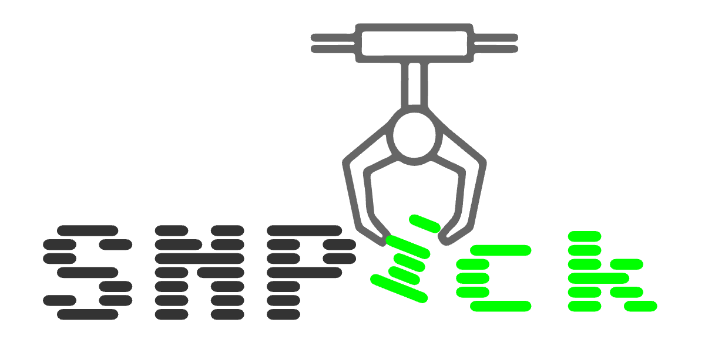
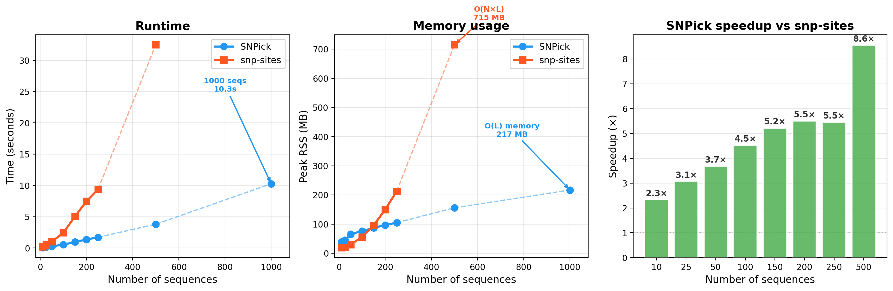

<p align="center">
  
</p>

<div align="center">

[](LICENSE)
[](https://doi.org/10.5281/zenodo.14191809)
[](https://github.com/PathoGenOmics-Lab)
[](https://anaconda.org/bioconda/snpick)
[](https://anaconda.org/bioconda/snpick)
[](http://bioconda.github.io/recipes/snpick/README.html)
[](https://pathogenomics-lab.github.io/snpick/)

**Fast, memory-efficient extraction of variable sites from FASTA alignments.**

**[📖 Documentation](https://pathogenomics-lab.github.io/snpick/)** · [Quick Start](#-quick-start) · [Features](#-features) · [Usage](#-usage) · [Benchmarks](#-benchmarks) · [Citation](#-citation) · [Changelog](CHANGELOG.md)

</div>

__Paula Ruiz-Rodriguez<sup>1</sup>__
__and Mireia Coscolla<sup>1</sup>__
<br>
<sub> 1. Institute for Integrative Systems Biology, I<sup>2</sup>SysBio, University of Valencia-CSIC, Valencia, Spain </sub>

---

## What is SNPick?

SNPick extracts variable (SNP) sites from whole-genome FASTA alignments. It produces reduced alignments ready for phylogenetic inference with ascertainment bias correction (ASC) in **IQ-TREE** and **RAxML**, and optionally generates VCF files.

**Why not snp-sites?** snp-sites works well for small datasets but struggles with large alignments — it loads everything into memory and scales poorly. SNPick uses a zero-copy memory-mapped architecture that handles thousands of genomes in seconds with minimal RAM.

> 📖 **Full documentation — [pathogenomics-lab.github.io/snpick](https://pathogenomics-lab.github.io/snpick/)** — installation, the complete usage reference, output formats, benchmarks, architecture, and a hands-on [tutorial](https://pathogenomics-lab.github.io/snpick/tutorials/tutorial/).

### SNPick vs snp-sites

| | **SNPick** | **snp-sites** |
|---|---|---|
| Architecture | Zero-copy mmap, parallel scan | Full matrix in memory |
| 250 seqs × 4.4 Mbp | **1.72 s**, 105 MB | 9.38 s, 213 MB |
| 1000 seqs × 4.4 Mbp | **10.27 s**, 217 MB | killed (OOM) |
| ASC fconst output | ✅ Built-in | ❌ Not supported |
| VCF output | ✅ Optional | ✅ Default |
| Gap handling | ✅ Optional (`-g`) | ✅ Default |
| IUPAC ambiguous | ✅ Tracked as ambiguous | ⚠️ Treated as variant |

---

## 🚀 Quick Start

```bash
# Install
conda install -c bioconda snpick

# Extract variable sites
snpick -f alignment.fasta -o snps.fasta

# With a VCF (reference-anchored POS) and a machine-readable summary
snpick -f alignment.fasta.gz -o snps.fasta --vcf --chrom NC_000962.3 \
       --ref-coords --stats-json stats.json

# Drop singletons, keep biallelic sites, mask repetitive regions
snpick -f alignment.fasta -o snps.fasta --mac 2 --max-alleles 2 --mask exclude.bed

# NEXUS output on 8 threads, quietly
snpick -f alignment.fasta -o snps.nex --format nexus -t 8 -q

# Just the statistics, no files written
snpick -f alignment.fasta --dry-run --stats-json -
```

---

## ✨ Features

### Variable site extraction

Identifies positions with more than one observed nucleotide across all sequences. Constant and ambiguous-only positions are excluded from the output.

### ASC bias correction support

Reports constant site counts (`fconst`) directly, formatted for IQ-TREE's `+ASC` models:

```
[snpick] ASC fconst: 744123,1382922,1382180,743556
```

Use in IQ-TREE:
```bash
iqtree2 -s snps.fasta -m GTR+ASC -fconst 744123,1382922,1382180,743556
```

### VCF generation

Optional VCF v4.2 output with per-sample genotypes. Reference allele taken from the first sequence. Ambiguous bases reported as missing (`.`). `POS` is the 1-based alignment column (not an ungapped reference coordinate) and `CHROM` defaults to `1` — set it with `--chrom` (e.g. `NC_000962.3`) to match your reference.

### IUPAC and gap handling

- **Ambiguous bases** (N, R, Y, etc.): not counted as alleles — positions are only variable if they have ≥2 standard bases (A, C, G, T)
- **Gaps** (`-`): ignored by default, included as a 5th character with `-g`. In the VCF, gap alleles are written as `*` (an alignment-gap convention shared with snp-sites; note some downstream tools read `*` as a spanning deletion)

### Parallel processing

Automatic multi-threaded scanning via Rayon when the dataset is large enough. Falls back to single-threaded for small inputs to avoid overhead. Cap the thread count with `-t/--threads` (e.g. to match a SLURM allocation); the thread count never changes the output, only the wall-clock time.

### Per-site filtering

Drop low-quality or uninformative sites in the same pass — no round-trip through `vcftools`:

- `--max-missing <f>` — maximum fraction of missing genotypes per site
- `--mac <n>` / `--maf <f>` — minimum minor-allele count / frequency (drop singletons, sequencing-error alleles)
- `--min-samples <n>` — minimum samples with data
- `--max-alleles <n>` — e.g. `2` keeps only biallelic sites

Filtered sites are **variable** sites removed from the output only — they never re-enter `fconst`, so ASC stays valid.

### Sample selection

`--keep-samples` / `--exclude-samples` (comma-separated IDs or `@file`) subset the panel **before** the scan, so `fconst` and site classification are recomputed for exactly the retained samples — a site variable only because of a dropped outlier correctly becomes constant.

### Region masking & reference coordinates

- `--mask <BED>` excludes regions (PE/PPE, mobile elements, resistance genes) from both the output **and** `fconst`. `--mask-ref` reads the BED in reference coordinates.
- `--reference <ID>` chooses the REF/polarity sequence (and the VCF `##reference`).
- `--ref-coords` writes VCF `POS` as ungapped reference positions; `--sites-output <TSV>` maps each site's alignment column → reference position → REF/ALT.

### Output formats

`--format {fasta,phylip,nexus}` — FASTA (default), relaxed PHYLIP (IQ-TREE / RAxML) or a NEXUS DATA block (MrBayes / PAUP* / SplitsTree).

### Compressed & streaming I/O

Reads plain or **gzip/bgzip** FASTA transparently, from a file or **stdin** (`-f -`); writes the reduced FASTA to a file or **stdout** (`-o -`) for piping.

### Machine-readable output & QC

- `--stats-json <FILE>` (or `-` for stdout) — a typed JSON summary (counts + the `fconst` array), so pipelines never scrape stderr.
- `--dry-run` — report statistics without writing any output.
- `--check` — audit the alignment composition (A/C/G/T, N, gap, IUPAC, invalid fractions) and exit.
- `--on-invalid {ignore,warn,error}` — guard against non-nucleotide input (e.g. a protein alignment).
- `--iupac-mode resolve` — optionally resolve IUPAC codes (R = A|G, …) to their bases when classifying.
- `-v`/`-vv` — extra diagnostics and an allele-class histogram.

---

## 💾 Installation

### Bioconda (recommended)

```bash
conda install -c bioconda snpick
# or
mamba install -c bioconda snpick
```

### From source

```bash
git clone https://github.com/PathoGenOmics-Lab/snpick.git
cd snpick
cargo build --release
# Binary at target/release/snpick
```

### Pre-built binary

Grab the binary for your platform from the [latest release](https://github.com/PathoGenOmics-Lab/snpick/releases/latest) — Linux (`x86_64`, `aarch64`) and macOS (`x86_64`, `aarch64`), with `SHA256SUMS.txt` published for verification:

```bash
# choose: snpick-linux-x86_64 | snpick-linux-aarch64 | snpick-macos-x86_64 | snpick-macos-aarch64
curl -LO https://github.com/PathoGenOmics-Lab/snpick/releases/latest/download/snpick-linux-x86_64
chmod +x snpick-linux-x86_64
./snpick-linux-x86_64 --help
```

### Container

```bash
docker run --rm -v "$PWD:/data" ghcr.io/pathogenomics-lab/snpick \
  -f /data/alignment.fasta -o /data/snps.fasta
```

Also available as an [Apptainer/Singularity](snpick.def) image.

### Library & bindings

snpick is also a Rust **library crate** ([docs](https://pathogenomics-lab.github.io/snpick/)), with **Python** (`bindings/python`, via [maturin](https://www.maturin.rs)) and **WebAssembly** (`bindings/wasm`) bindings for use in notebooks, pipelines and the browser.

---

## 🗃️ Usage

```
snpick [OPTIONS] --fasta <FASTA>
```

`-f/--fasta` is always required; `-o/--output` is required unless `--dry-run` or `--check`.
Use `-` for `--fasta` (stdin) or for any one of `--output`, `--vcf-output`, `--sites-output` or `--stats-json` (stdout; at most one at a time). See `snpick --help` for the authoritative list.

**Core**

| Argument | Description |
|---|---|
| `-f, --fasta <FILE>` | Input FASTA alignment (`-` = stdin; gzip/bgzip auto-detected) |
| `-o, --output <FILE>` | Output FASTA of variable sites (`-` = stdout) |
| `-g, --include-gaps` | Treat gaps (`-`) as a 5th character |
| `--format <FMT>` | `fasta` (default), `phylip`, or `nexus` |
| `-t, --threads <N>` | Threads for the parallel scan (default: all cores) |
| `-q, --quiet` · `-v`/`-vv` | Silence logs · increase detail |

**VCF & coordinates**

| Argument | Description |
|---|---|
| `--vcf` · `--vcf-output <FILE>` | Write a VCF (derived name, or a custom path) |
| `--chrom <NAME>` | CHROM / contig name (default `1`) |
| `--reference <ID>` | REF/polarity sequence (default: first) |
| `--ref-coords` | VCF `POS` as ungapped reference positions |
| `--sites-output <TSV>` | Per-site alignment→reference coordinate map |

**Filtering & masking**

| Argument | Description |
|---|---|
| `--max-missing <f>` | Max fraction of missing genotypes per site |
| `--mac <n>` · `--maf <f>` | Min minor-allele count / frequency |
| `--min-samples <n>` | Min samples with data |
| `--max-alleles <n>` | Max distinct alleles (`2` = biallelic) |
| `--keep-samples` / `--exclude-samples <IDs>` | Subset samples (list or `@file`) |
| `--mask <BED>` · `--mask-ref` | Mask regions (alignment or reference coords) |

**QC, reporting & robustness**

| Argument | Description |
|---|---|
| `--stats-json <FILE>` | Machine-readable JSON summary (`-` = stdout) |
| `--dry-run` · `--check` | Stats only · composition audit, then exit |
| `--on-invalid <MODE>` | `ignore` (default) · `warn` · `error` on non-nucleotides |
| `--iupac-mode <MODE>` | `missing` (default) · `resolve` ambiguity codes |
| `--allow-dup-ids` | Permit duplicate sequence IDs |

**Exit codes:** `0` success · `1` I/O error · `2` bad input/data.

### Example

**Input** (`alignment.fasta`):
```
>sequence1
ATGCTAGCTAGCTAGCTA
>sequence2
ATGCTAGCTGGCTAGCTA
>sequence3
ATGCTAGCTAGCTAGCTA
```

**Command:**
```bash
snpick -f alignment.fasta -o snps.fasta
```

**Output** (`snps.fasta`):
```
>sequence1
A
>sequence2
G
>sequence3
A
```

**stderr:**
```
[snpick] Mapped 90 bytes. 3 sequences × 18 positions.
[snpick] 1 variable, 17 constant (A:4 C:4 G:4 T:5), 0 ambiguous-only, 18 total.
[snpick] ASC fconst: 4,4,4,5
[snpick] Done in 0.00s. 1 vars from 3 seqs × 18 pos.
```

---

## 📊 Benchmarks

Simulated *M. tuberculosis*-like genomes (4.4 Mbp, ~65% GC, 3.6% variable sites).

### Scaling by number of sequences

<p align="center">
  
</p>

### Scaling by sequence length

<p align="center">
  
</p>

SNPick's memory grows far more slowly than snp-sites' **O(N×L)** — ≈39 MB at 10 sequences up to ≈217 MB at 1000, versus snp-sites holding the full matrix in memory until it is killed on large inputs.

---

## 🏗️ Architecture

```
Input FASTA ──mmap──▶ Index records ──▶ Pass 1: bitmask scan ──▶ Analyze
                           │                    (parallel)           │
                           │                                         ▼
                           └──────────▶ Pass 2: extract sites ──▶ FASTA + VCF
                                         (sparse random access)
```

- **Single memory-mapped file** shared across both passes — zero copies
- **Pass 1**: OR-based bitmask over all sequences (parallel with Rayon)
- **Pass 2**: only reads variable positions (sparse access via mmap)
- **Lookup tables**: 256-byte arrays for O(1) nucleotide classification and case conversion

---

## 📝 Citation

If you use SNPick in your research, please cite:

```bibtex
@software{snpick,
  author    = {Ruiz-Rodriguez, Paula and Coscolla, Mireia},
  title     = {SNPick: Fast extraction of variable sites from FASTA alignments},
  url       = {https://github.com/PathoGenOmics-Lab/snpick},
  doi       = {10.5281/zenodo.14191809},
  license   = {GPL-3.0}
}
```

---

<h2 align="center">✨ Contributors</h2>

<div align="center">
<table>
  <tr>
    <td align="center">
      <a href="https://github.com/paururo">
        
        <br />
        <sub><b>Paula Ruiz-Rodriguez</b></sub>
      </a>
      <br />
      <a href="" title="Code">💻</a>
      <a href="" title="Research">🔬</a>
      <a href="" title="Ideas">🤔</a>
      <a href="" title="Data">🔣</a>
      <a href="" title="Design">🎨</a>
      <a href="" title="Tool">🔧</a>
    </td>
    <td align="center">
      <a href="https://github.com/mireiacoscolla">
        
        <br />
        <sub><b>Mireia Coscolla</b></sub>
      </a>
      <br />
      <a href="" title="Funding">🔍</a>
      <a href="" title="Ideas">🤔</a>
      <a href="" title="Mentoring">🧑‍🏫</a>
      <a href="" title="Research">🔬</a>
      <a href="" title="User Testing">📓</a>
    </td>
  </tr>
</table>

This project follows the [all-contributors](https://github.com/all-contributors/all-contributors) specification ([emoji key](https://allcontributors.org/docs/en/emoji-key)).

</div>
