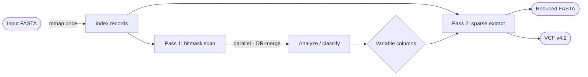

---
tags:
  - internals
---

# Architecture

SNPick memory-maps the input once and shares it, read-only, across two passes — **no copies of
the sequence data are ever made**.

## Indexing

The FASTA is scanned once to record, for each sequence, the byte offset of its data and its
length as zero-copy slices into the mmap. All sequences must have the same length (an alignment
requirement); a mismatch is a hard error. The indexer detects whether the file is single-line or
wrapped (multi-line) so later passes can pick the fastest access strategy.

## Pass 1 — bitmask scan

Each position accumulates a 5-bit mask (`A`, `C`, `G`, `T`, and gap) by OR-ing every sequence's
base at that column. Once built, each column is classified:

- **variable** — more than one allele present,
- **constant** — exactly one standard base,
- **ambiguous-only** — no standard base (all N/gap without `-g`).

For large inputs the scan runs in parallel: records are split into disjoint chunks, each thread
fills its own bitmask, and the partials are merged with OR. Because OR is commutative and
associative, the parallel result is **byte-for-byte identical** to a sequential scan — thread
count never affects output. Small inputs fall back to a single-threaded scan to avoid overhead.

Before the hot loop, SNPick prefaults the mapped pages and hints the OS that access is sequential,
eliminating soft page faults on multi-gigabyte files.

## Pass 2 — sparse extraction

Only the variable columns are read back, via sparse random access into the mmap, and written to
the reduced FASTA. When a VCF is requested the same pass fills a compact genotype matrix, which
is then emitted as VCF rows assembled in a reused byte buffer (avoiding a formatted write per
genotype).

## Design notes

- **Lookup tables** — 256-byte arrays give O(1) nucleotide classification and case conversion.
- **Zero-copy** — IDs, descriptions, and sequence bytes are slices into the single mmap.
- **O(L) memory** — the working set scales with alignment length, not with the number of
  sequences, which is what lets SNPick handle thousands of genomes with a small footprint.

The source is split into focused modules: `fasta` (indexing), `scan` (pass 1 + classification),
`extract` (pass 2), `vcf` (VCF writer), and `types` (shared constants and lookup tables).
