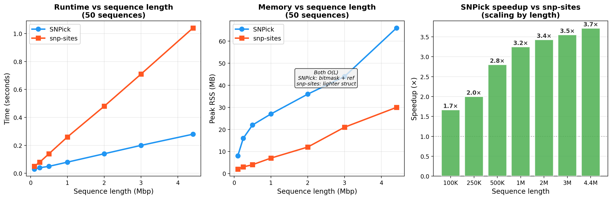

---
tags:
  - performance
---

# Benchmarks

Benchmarks use simulated *M. tuberculosis*-like genomes (4.4 Mbp, ~65% GC, 3.6% variable sites).
The figures below are the committed run in
[`benchmarks/results.tsv`](https://github.com/PathoGenOmics-Lab/snpick/blob/main/benchmarks/results.tsv);
absolute wall-clock and peak memory depend on the host CPU and thread count.

## Scaling by number of sequences

  

## Scaling by sequence length

  

SNPick's memory grows far more slowly than snp-sites' **O(N × L)**: snp-sites holds the full
matrix in memory and is eventually killed on large inputs, while SNPick's footprint rises only
gently with sequence count (≈39 MB at 10 sequences up to ≈217 MB at 1000).

| Dataset | SNPick | snp-sites |
|---|---|---|
| 250 seqs × 4.4 Mbp | **1.72 s**, 105 MB | 9.38 s, 213 MB |
| 1000 seqs × 4.4 Mbp | **10.27 s**, 217 MB | killed (OOM) |

!!! tip "Reproducing"
    Wall-clock depends on core count; pin it with [`--threads`](usage.md#core)
    for comparable runs. The extracted sites and VCF are identical regardless of thread count.
